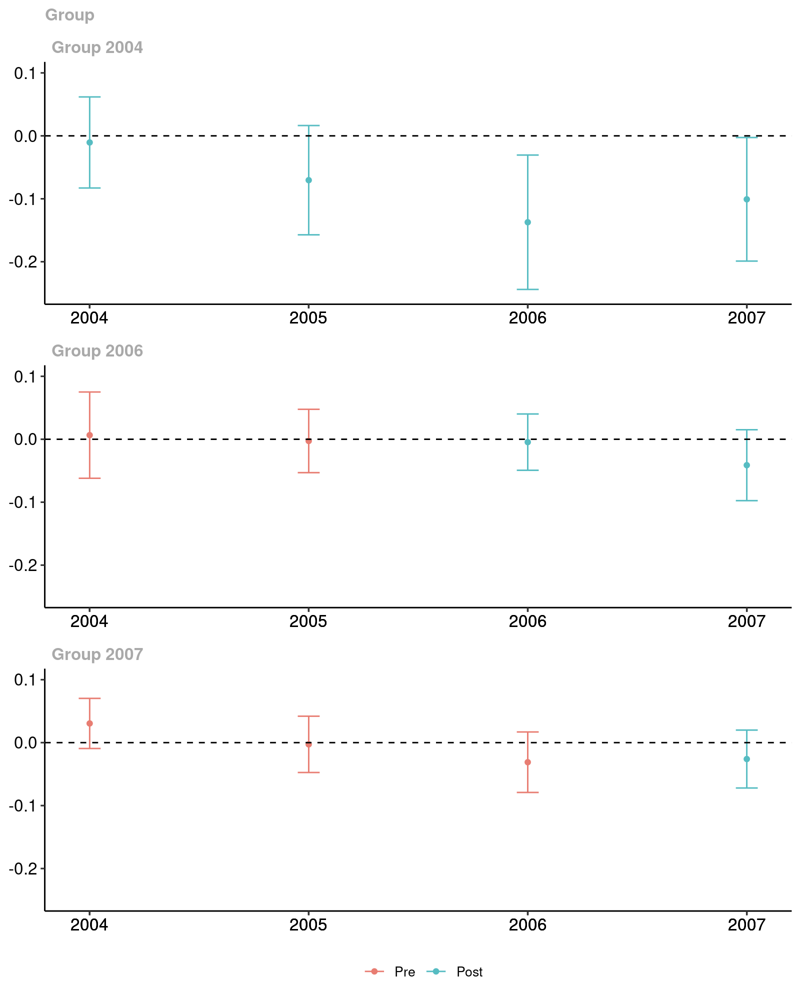
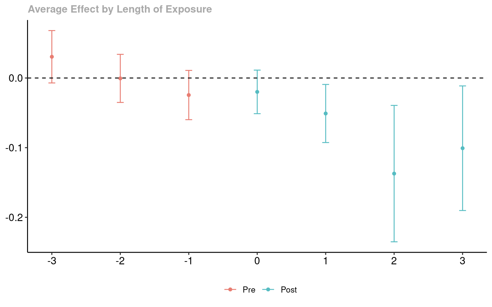

<!-- README.md is generated from README.Rmd. Please edit that file -->


<!-- badges: start -->
[](https://cran.r-project.org/package=did)

[](https://cran.r-project.org/package=did)

[](https://cran.r-project.org/package=did)

[](https://github.com/bcallaway11/did)

[](https://github.com/bcallaway11/did)

[](https://cran.r-project.org/web/checks/check_results_did.html)

<!-- badges: end -->
<!-- README.md is generated from README.Rmd. Please edit that file -->

** PACKAGE IS CURRENTLT BEING UPDATED. BE AWARE **
The **did** package contains tools for computing average treatment effect parameters in a Difference in Differences setup allowing for

-   More than two time periods

-   Variation in treatment timing (i.e., units can become treated at different points in time)

-   Treatment effect heterogeneity (i.e, the effect of participating in the treatment can vary across units and exhibit potentially complex dynamics, selection into treatment, or time effects)

-   The parallel trends assumption holds only after conditioning on covariates

The main parameters are **group-time average treatment effects**. These are the average treatment effect for a particular group (group is defined by treatment timing) in a particular time period. These parameters are a natural generalization of the average treatment effect on the treated (ATT) which is identified in the textbook case with two periods and two groups to the case with multiple periods.

Group-time average treatment effects are also natural building blocks for more aggregated treatment effect parameters such as overall treatment effects or event study plots.

The **did** package also contains a number of functions for pre-testing the parallel trends assumption.

Getting Started
---------------

There has been a lot of recent work on DID with multiple time periods. The **did** package implements the ideas in

-   Callaway, Brantly, and Pedro HC Sant'Anna. Difference-in-differences with multiple time periods. Available at SSRN 3148250 (2019).

**Other methodological papers on DID with multiple time periods include**

-   Goodman-Bacon, Andrew. Difference-in-differences with variation in treatment timing. No. w25018. National Bureau of Economic Research, 2018.

-   de Chaisemartin, Clément, and Xavier d'Haultfoeuille. Two-way fixed effects estimators with heterogeneous treatment effects. No. w25904. National Bureau of Economic Research, 2019.

-   Abraham, Sarah, and Liyang Sun. Estimating dynamic treatment effects in event studies with heterogeneous treatment effects. Available at SSRN 3158747 (2018).

**Higher level discussions of issues are available in**

-   [Our approach to DID with multiple time periods](articles/multi-period-did.html)

-   [Baker, Andrew. Difference-in-Differences Methodology. (2019)](https://andrewcbaker.netlify.com/2019/09/25/difference-in-differences-methodology/)

Installation
------------

You can install **did** from CRAN with:

``` r
install.packages("did")
```

or get the latest version from github with:

``` r
# install.packages("devtools")
devtools::install_github("bcallaway11/did")
```

A short example
---------------

The following is a simplified example of the effect of states increasing their minimum wages on county-level teen employment rates which comes from Callaway and Sant'Anna (2019).

-   [More detailed examples are also available](articles/did-basics)

A subset of the data is available in the package and can be loaded by

``` r
  library(did)
#> 
#> Attaching package: 'did'
#> The following objects are masked _by_ '.GlobalEnv':
#> 
#>     compute.aggte, ggdid, gplot, indicator, MP, mp.spatt,
#>     mp.spatt.test, MP.TEST
  data(mpdta)
```

The dataset contains 500 observations of county-level teen employment rates from 2003-2007. Some states are first treated in 2004, some in 2006, and some in 2007 (see the paper for more details). The important variables in the dataset are

-   **lemp** This is the log of county-level teen employment. It is the outcome variable

-   **first.treat** This is the period when a state first increases its minimum wage. It can be 2004, 2006, or 2007. It is the variable that defines *group* in this application

-   **year** This is the year and is the *time* variable

-   **countyreal** This is an id number for each county and provides the individual identifier in this panel data context

To estimate group-time average treatment effects, use the **att\_gt** function

``` r
out <- att_gt(yname="lemp",
              first.treat.name="first.treat",
              idname="countyreal",
              tname="year",
              xformla=~1,
              data=mpdta,
              estMethod="reg",
              printdetails=FALSE,
              )
```

**att\_gt** returns a class **MP** object. This has a lot of information, but most importantly is has estimates of the group-time average treatment effects and their standard errors. To see these, we can call the **summary** function

``` r
summary(out)
#> 
#> Reference: Callaway, Brantly and Sant'Anna, Pedro.  "Difference-in-Differences with Multiple Time Periods." Working Paper <https://ssrn.com/abstract=3148250>, 2019. 
#> 
#> 
#> 
#>  group   time          att          se
#> ------  -----  -----------  ----------
#>   2004   2004   -0.0105032   0.0232510
#>   2004   2005   -0.0704232   0.0309848
#>   2004   2006   -0.1372587   0.0364357
#>   2004   2007   -0.1008114   0.0343592
#>   2006   2004    0.0065201   0.0233268
#>   2006   2005   -0.0027508   0.0195586
#>   2006   2006   -0.0045946   0.0177552
#>   2006   2007   -0.0412245   0.0202292
#>   2007   2004    0.0305067   0.0150336
#>   2007   2005   -0.0027259   0.0163958
#>   2007   2006   -0.0310871   0.0178775
#>   2007   2007   -0.0260544   0.0166554
#> 
#> 
#> P-value for pre-test of DID assumption:  0.16812
```

This provides estimates of group-time average treatment effects for all groups in all time periods. Group-time average treatment effects are identified when `g <= t` (these are post-treatment time periods for each group), but **summary** reports them even in periods when `g > t` -- these can be used a pre-test for the parallel trends assumption. The `p-value for pre-test of DID assumption` is for a Wald pre-test of the parallel trends assumption. Here the parallel trends assumption would not be rejected at conventional significance levels.

It is often also convenient to plot the group-time average treatment effects. This can be done using the **ggdid** command:

``` r
ggdid(out, ylim=c(-.25,.1))
```



The red dots in the plot are pre-treatment group-time average treatment effects . Here they are provided with 95% pointwise confidence intervals. These are the estimates that can be interpreted as a pre-test (up to some caveats about multiple hypothesis testing). The blue dots are post-treatment group-time average treatment effects. Under the parallel trends assumption, these can be interpreted as policy effects -- here the effect of the minimum wage on county-level teen employment due to increasing the minimum wage.

**Event Studies**

Although in the current example it is pretty easy to directly interpret the group-time average treatment effects, there are many cases where it is convenient to aggregate the group-time average treatment effects into a small number of parameters. A main type of aggregation is into an *event study* plot.

To make an event study plot in the **did** package, one can use the **aggte** function

``` r
es <- aggte(out, type="dynamic")
```

Just like for group-time average treatment effects, these can be summarized and plotted. And then one can summarize these

``` r
summary(es)
#> 
#> Reference: Callaway, Brantly and Sant'Anna, Pedro.  "Difference-in-Differences with Multiple Time Periods." Working Paper <https://ssrn.com/abstract=3148250>, 2019. 
#> 
#> Overall ATT:  
#> 
#> 
#>         att         se
#> -----------  ---------
#>  -0.0772398   0.019965
#> 
#> 
#> Dynamic Effects:
#> 
#> 
#>  event time          att          se
#> -----------  -----------  ----------
#>          -3    0.0305067   0.0150336
#>          -2   -0.0005631   0.0132916
#>          -1   -0.0244587   0.0142364
#>           0   -0.0199318   0.0118264
#>           1   -0.0509574   0.0168935
#>           2   -0.1372587   0.0364357
#>           3   -0.1008114   0.0343592
```

The column `event time` is for each group relative to when they first participate in the treatment. To give some examples, `event time=0` corresponds to the *on impact* effect, and `event time=-1` is the *effect* in the period before a unit becomes treated (checking that this is equal to 0 is potentially useful as a pre-test).

To plot the event study, use **ggdid**

``` r
ggdid(es)
```



The figure here is very similar to the group-time average treatment effects. Red dots are pre-treatment periods, blue dots are post-treatment periods. The difference is that the x-axis is in event time.
